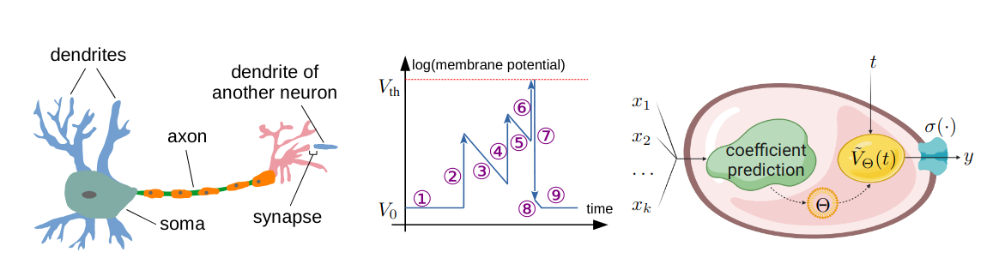

# PPLNs: Parametric Piecewise Linear Networks for Event-Based Temporal Modeling and Beyond

This repository contains authors' implementation of [PPLNs: Parametric Piecewise Linear Networks for Event-Based Temporal Modeling and Beyond](https://arxiv.org/). Our implementation uses the PyTorch library. We warmly welcome any discussions related to our implementation and our paper. Please feel free to open an issue.


## Introduction
We present Parametric Piecewise Linear Networks (PPLNs) for temporal vision inference. Motivated by the neuromorphic principles that regulate biological neural behaviors, PPLNs are ideal for handling data captured by event cameras, which are built to simulate neural activities in the human retina. We discuss how to represent the membrane potential of an artificial neuron by a parametric piecewise linear function with learnable coefficients. We show how a simple modification allows standard multi-layer perceptrons and convolution operators to support this membrane potential parameterization. We use extensive experiments to demonstrate the state-of-the-art performance of PPLNs in various event-based and conventional image-based vision applications, including steering prediction, human pose estimation, and motion deblurring.


## Environment set-up
Please install [Anaconda](https://www.anaconda.com/distribution/) first and execute the following commands:
```
conda create -y --name ppln python==3.8.11
conda install -y -q --name ppln -c pytorch -c conda-forge --file requirements.txt
conda activate ppln
```

## Experiments
Please refer to [SteeringPrediction/README.md](SteeringPrediction/README.md), [HumanPoseEstimation/README.md](HumanPoseEstimation/README.md), and [MotionDeblurring/README.md](MotionDeblurring/README.md) for instructions to work with PPLNs on three example tasks described in our paper.

## Using PPLNs in Your Project
We provide the implementation of `SpikingConv2d`, `SpikingConvTranspose2d`, and `SpikingLinear` in [modules.py](HumanPoseEstimation/ours/lib/models/modules.py). They are extensions to `nn.Conv2d`, `nn.ConvTranspose2d`, and `nn.Linear`.

Example usage:
```python
from modules import *

x = torch.zeros((3, 2, 180, 240)).cuda()
sconv = SpikingConv2d(2, 4, 3, spiking_segment_count=3, padding=1, stride=2).cuda()
t = torch.zeros((3,)).cuda()
x1 = sconv(x, t)

x = torch.zeros((3, 2, 90, 120)).cuda()
sconvt = SpikingConvTranspose2d(2, 4, 5, stride=2, padding=2, output_padding=(1, 1)).cuda()
x1 = sconvt(x, t)

x = torch.zeros((3, 128)).cuda()
slinear = SpikingLinear(128, 32, norm='constant').cuda()
x1 = slinear(x, t)
```

